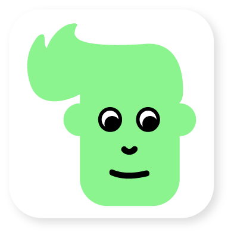

<!-- PROJECT LOGO -->
 

    

  <h3 align="center">FAITH</h3>
  <h4 align="center">FAciliterende IT bij individuele begeleidingsgesprekken in de jeugdHulp.</h4>

  

    Repository used for the application being developed for the FAITH project. 
  

<!-- TABLE OF CONTENTS -->
## Table of Contents

* [About the Project](#about-the-project)
  * [Built With](#built-with)
* [Getting Started](#getting-started)
  * [Prerequisites](#prerequisites)
  * [Installation](#installation)
* [Usage](#usage)
* [Roadmap](#roadmap)
* [Contributing](#contributing)
* [License](#license)
* [Contact](#contact)
* [Acknowledgements](#acknowledgements)

<!-- ABOUT THE PROJECT -->
## About The Project

Notwithstanding the great importance of individual counseling discussions, we see that the
motivation for participating in these conversations is not always the same for some children
or young people. Talking about loaded themes is often not obvious either.
Within youth care, counselors actively look for methodologies and tools that motivate children
for these conversations and which facilitate talking about these charged topics.
With FAITH, we want to develop a digital conversation tool that meets these needs.

HOGENT develops a digital tool that provides support for individual conversations with children
and young people within youth care, because high-quality individual support is a necessary condition
for constructive assistance. A discussion tool that has a motivating and facilitating capacity for
conducting individual counseling interviews is a clear added value for providing assistance.
The discussion tool can facilitate conversations on difficult topics, because we work with visual
and metaphorical material. Given their affinity with the digital world, the digital nature of
the instrument motivates children and young people to start the conversation.
The conversation tool can also store data, which contributes to continuity in the counseling process.

### Built With
This section should lists the major frameworks that we used to build the project.
* [Gradle](https://gradle.org)
* [FireBase](https://firebase.google.com)

TODO: add features

<!-- GETTING STARTED -->
## Getting Started

To get a local copy up and running follow these simple example steps.

### Installation

TODO

<!-- USAGE EXAMPLES -->
## Usage

TODO

<!-- ROADMAP -->
## Roadmap

TODO

<!-- CONTRIBUTING -->
## Contributing

Contributions are what make the open source community such an amazing place to be learn, inspire, and create. Any contributions you make are **greatly appreciated**.

1. Fork the Project
2. Create your Feature Branch (`git checkout -b feature/AmazingFeature`)
3. Commit your Changes (`git commit -m 'Add some AmazingFeature'`)
4. Push to the Branch (`git push origin feature/AmazingFeature`)
5. Open a Pull Request

<!-- LICENSE -->
## License

TODO

<!-- CONTACT -->
## Contact

- Jens Buysse - [@jensbuy](https://twitter.com/jensbuy) - jens.buysse@hogent.be
- Harm De Weird 
- Karine Samyn

Project Link: [https://hogent.be/projecten/faith/](https://hogent.be/projecten/faith/)

<!-- ACKNOWLEDGEMENTS -->
## Acknowledgements

TODO

<!-- MARKDOWN LINKS & IMAGES -->
<!-- https://www.markdownguide.org/basic-syntax/#reference-style-links -->
[contributors-shield]: https://img.shields.io/github/contributors/othneildrew/Best-README-Template.svg?style=flat-square
[contributors-url]: https://github.com/othneildrew/Best-README-Template/graphs/contributors
[forks-shield]: https://img.shields.io/github/forks/othneildrew/Best-README-Template.svg?style=flat-square
[forks-url]: https://github.com/othneildrew/Best-README-Template/network/members
[stars-shield]: https://img.shields.io/github/stars/othneildrew/Best-README-Template.svg?style=flat-square
[stars-url]: https://github.com/othneildrew/Best-README-Template/stargazers
[issues-shield]: https://img.shields.io/github/issues/othneildrew/Best-README-Template.svg?style=flat-square
[issues-url]: https://github.com/othneildrew/Best-README-Template/issues
[license-shield]: https://img.shields.io/github/license/othneildrew/Best-README-Template.svg?style=flat-square
[license-url]: https://github.com/othneildrew/Best-README-Template/blob/master/LICENSE.txt
[linkedin-shield]: https://img.shields.io/badge/-LinkedIn-black.svg?style=flat-square&logo=linkedin&colorB=555
[linkedin-url]: https://linkedin.com/in/othneildrew
[product-screenshot]: images/screenshot.png